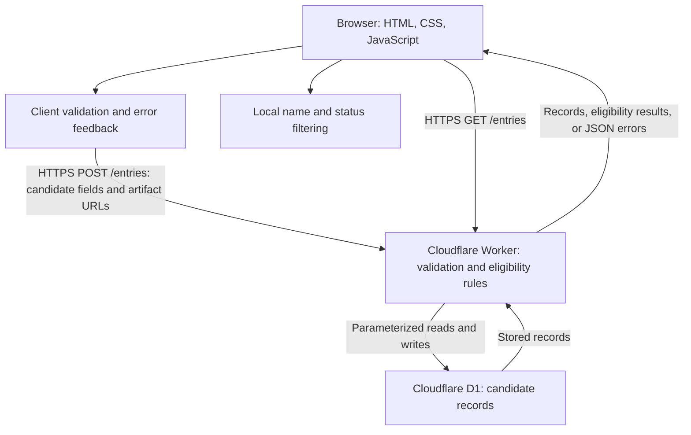

# ARCHITECTURE.md

Accountable: Rishi Ajith (Architect).

## The Gate: Build, Buy, or Delegate

### Weights (commit before scores)
| Criterion | Weight | Reason |
| Cost to start | 4 | Keep the course prototype within a 0 dollar budget. |
| Cost to maintain | 3 | Keep ongoing costs and upkeep manageable for the team. | 
| Time to working | 4 | Build and verify the prototype within 3 weeks. |
| Inspectability | 5 | Teammates must understand eligibility rules, validation, and data access. |
| Switching cost | 4 | HW4 required schema and client changes; HW5 showed substantial delegation review effort. |
| Fit to specification | 5 | Support candidate intake, validation, persistence, filtering, and artifact records. |

### Scoring anchors
Higher scores are better. Scores 2 and 4 fall between these anchors.

| Criterion | 1 means | 3 means | 5 means |
| Cost to start | Payment required | Free with substantial setup | Free with minimal setup |
| Cost to maintain | High recurring cost or upkeep | Manageable upkeep | Little upkeep and no expected cost at prototype scale |
| Time to working | Exceeds 3 weeks | Fits with significant integration work | Quickly testable with familiar components |
| Inspectability | Core behavior can't be inspected | Team can explain some components | Team can inspect and explain rules, schema, and data access |
| Switching cost | Major rewrite and difficult data recovery | Export plus integration changes | Portable data with limited integration changes |
| Fit to specification | Essential requirements unmet | Most requirements met with workarounds | All required behavior supported |

### Scores
**Decision:** How should the team implement candidate intake, eligibility checks, validation, persistent records, filtering, and artifact links?
**Build:** Team-written HTML/CSS/Javascript frontend with a Cloudflare Worker API and D1 database. The team owns validation, eligibility rules, and data-access logic.
**Buy:** Use an existing hosted service such as Airtable, with forms, stored candidate records, filtered views, and configured eligibility formulas. Evaluate whether its available plan supports the required behavior and access controls.
**Delegate:** Have bolt.new generate the frontend and Cloudflare Worker/D1 integration from the team specification. The team inspects, tests, and maintains the output; AI never approves or merges it. PROJECT.md and FEATURES.md propose Cloudflare D1. The Gate evaluates that proposal; choosing another option would require coordinated updates to those files.

### Weighted scores
Scores are planning estimates, not test results. Each cell shows the score followed by its weighted value in parentheses.
| Criterion | Weight | Build | Buy | Delegate |
| Cost to start | 4 | 5 (20) | 3 (12) | 4 (16) |
| Cost to maintain | 3 | 4 (12) | 4 (12) | 3 (9) |
| Time to working | 4 | 4 (16) | 3 (12) | 3 (12) |
| Inspectability | 5 | 5 (25) | 3 (15) | 3 (15) |
| Switching cost | 4 | 4 (16) | 3 (12) | 3 (12) |
| Fit to specification | 5 | 5 (25) | 2 (10) | 4 (20) |
| **Weighted total** | | **114** | **73** | **84** |
### Score rationale and switching costs

**Build:** Rishi and Regina have already deployed Cloudflare Workers with D1 in HW4. This supports a time-to-working score of 4, although binding, CORS, and deployment troubleshooting still take time. Inspectability scores 5 because the team can review its own rules, schema, and API code. Fit scores 5 for the planned design, not the existing prototype: the team must still implement and verify the required behavior and access controls.
**Buy:** A hosted form-and-table service could support basic intake, records, and filtering. Fit scores 2 because the current specification explicitly requires Worker/D1 integration and particular API responses. Selecting Buy would require coordinated specification changes or additional custom code. Plan limits and access controls remain unverified; these scores are provisional.
**Delegate:** Regina's HW5 Bolt output preserved Worker/D1 and introduced no new dependencies, supporting a fit score of 4. However, her DDR reports 0.25 hours for generation and 5 hours for review/fixes, compared with 2.7 hours estimated for a manual build. Time-to-working therefore scores 3: generating code quickly does not establish verified delivery.
**Switching costs:** Rishi's HW4 move from localStorage to D1 required a schema, deployment configuration, and client fetch integration. His HW5 Bolt output used React/Vite and Supabase, illustrating how delegation can introduce a different stack. Regina's output preserved her stack, but still required extensive review. Build scores 4 because the team controls its schema and code, while leaving Cloudflare would still require data migration and integration changes. Buy and Delegate score 3 because exports, configuration, or generated dependencies may require additional migration work.
**Sensitivity check:** Reducing inspectability weight from 5 to 2 produces totals of Build 99, Buy 64, and Delegate 75. Build remains first.
**Recommendation:** Build, subject to team review and approval.
## ADR-001: Build the candidate screening prototype with Cloudflare Worker and D1

- **Date:** October 8, 2026
- **Status:** Proposed
- **Accountable:** Rishi Ajith (Architect)
- **Approver:** Pending
- **Door:** Build

- **Status:**
### Context
The team is extending Regina's evidence tracker into a candidate screening prototype for accounting and finance roles. PROJECT.md and FEATURES.md require candidate intake, eligibility checks, validation, persistent records, recruiter filtering, and artifact links. The Gate recommends Build (114 points), compared with Buy (73) and Delegate (84). The data crossing is from the browser to Cloudflare through the team's Worker API, then into D1. This includes the candidate name, degree information, graduation year, self-reported work authorization and relation readiness, coursework declarations, artifact URLs, and derived eligibility results. Artifact files are not uploaded; the system stores links. A valid link or self-reported qualification does not establish verified competence. Cloudflare processes this data under its applicable service terms and Workers/D1 usage limits. The team must record the applicable terms and data handling in TOOLS.md before deployment. Credentials remain server-side. Rishi Ajith is accountable for documenting this architecture and data crossing; deployment administration must be assigned to a named teammate. Regina's HW4 prototype used shared records without user separation. That is unsuitable for private applicant records. Until access controls are specified and tested, development and demonstrations will use synthetic candidate data only. CORS restrictions do not replace authentication or authorization.
### Options
1. Build — team-written HTML/CSS/JavaScript frontend, Cloudflare Worker API, and D1 database. Gate total: 114.
2. Buy — hosted forms, tables, and views such as Airtable. Gate total: 73. Selecting this option would require specification changes or additional integration. Plan limits and access controls remain unverified.
3. Delegate — bolt.new generates the frontend and Worker/D1 integration, followed by team inspection and testing. Gate total: 84. HW5 experience shows that review effort can exceed manual build time.
### Decision
Propose Build: a plain HTML/CSS/JavaScript frontend communicating with a Cloudflare Worker over HTTPS. The Worker performs authoritative schema validation and deterministic eligibility checks before saving candidate records to D1 through parameterized queries. Client validation provides immediate feedback; server validation rejects malformed requests with HTTP 400 and descriptive JSON errors. Valid submissions, including candidates who fail eligibility rules, are stored with their derived status and return HTTP 201. The frontend retrieves records through GET /entries and filters the returned list locally by candidate name and eligibility status. It retains entered form values when saving fails and displays a clear error. Artifact URLs and coursework declarations are recorded for human review. URL-format validation does not establish that an artifact is authentic or prove competence. The system does not automatically fetch external artifact URLs. The prototype uses synthetic candidate data until authentication and authorization requirements are agreed and tested. No credentials are embedded in the frontend. No product data is sent to an AI service during normal use. Approval of this proposal must be recorded by the named Approver before its status becomes Accepted.
### Consequences
**Easier:** The team can inspect eligibility rules, validation, and database queries directly. D1 persistence supports records surviving browser reloads and cleared browser storage. Local filtering avoids an additional request for each search or status-filter change. Existing HW4 experience reduces unfamiliar integration work. 
**Harder:** The team owns deployment, schema migrations, access controls, and failure handling. Loading and saving require a network connection. Local filtering requires downloading the authorized record set and may become unsuitable as it grows. Cloudflare outages or usage limits can interrupt the service; migration to another provider would require export and integration changes.
**Limits:** Stored artifact links and self-reported coursework are not independently verified competence. Database persistence alone does not create an immutable audit trail. The initial prototype must not claim either capability. Human artifact review and any protected audit history require explicit acceptance criteria and testing.
**Specification follow-up:** Coordinate with the Specifier to clarify F-05's verification meaning and USERS.md's immutable-audit-log claim. Define authorized access to candidate records before using real applicant data. These gaps are recorded explicitly rather than treated as implemented features.
### Revisit Trigger
Review this decision before Phase 2 implementation begins and no later than October 22, 2026. Reopen it sooner if the team needs real applicant data, independent credential verification, protected audit history, or a record volume that makes downloading and filtering the authorized list impractical. The Architect will bring revised options to the Approver. If the decision changes after acceptance, record a superseding ADR instead of silently rewriting the accepted decision. 
## Architecture Diagram

Client validation and filtering run in the browser. Only the Worker accesses D1. Artifact URLs are stored as text; external artifacts are reviewed by a human and are not automatically fetched. The initial prototype uses synthetic candidate data.
