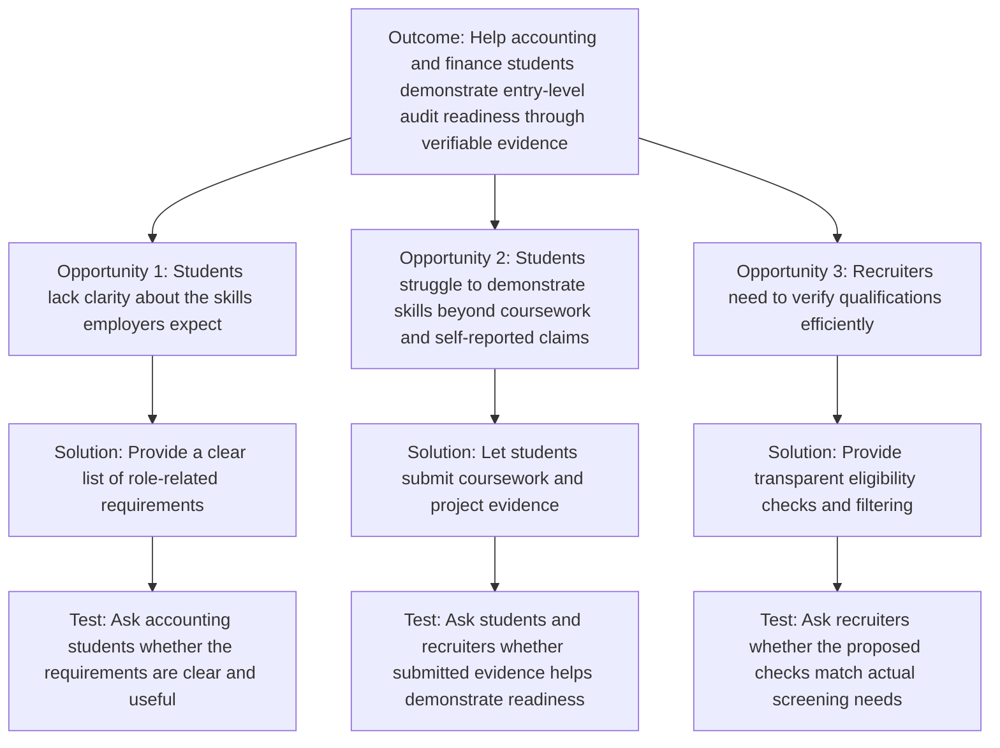

# EVALS.md

Accountable: Regina Choi (Reviewer). This file holds our opportunity solution tree, our riskiest assumption, the evals we plan for Phase 2, and each member's prediction.

## Opportunity Solution Tree

## Riskiest Assumption (RAT)

**Assumption:** Accounting students and recruiters will find it useful to evaluate accounting skills using actual coursework and project evidence.

**Where it comes from in the tree:** This is the assumption test under Solution 2 (let students submit coursework and project evidence). If this fails, Solutions 1 and 3 do not matter much, because the checks would have nothing real to look at.

**Why it is risky:** Students may not have enough practical experience to provide this evidence, and recruiters may prefer their existing screening methods. Our interviews support parts of the problem, but they do not prove that users would use our proposed tool.

**Test:** Interview accounting students or recent graduates and recruiters about how they currently prepare for or evaluate entry-level accounting applications. Ask them to review the proposed requirements and explain whether the evidence would help them.

**Evidence to collect:** Examples of evidence students can provide, how recruiters currently check qualifications, and specific feedback about the proposed tool.

**Deadline:** We will run these interviews by October 22, so the results can change Phase 2 before we build too much.

**Decision rule:** We will talk to at least 3 students or recent graduates and at least 2 recruiters. We continue with the current solution if at least 2 of the 3 students can name a real piece of coursework or project evidence they could submit, and at least 1 of the 2 recruiters says this kind of evidence would help them screen. If fewer people say that, we revise the problem or the solution before building more.

## Evals Planned for Phase 2

### Evaluation 1: Requirement Clarity

* **Question:** Can accounting students understand the role requirements and identify what they need to demonstrate?
* **Method:** Ask students or recent graduates to review the proposed requirements and explain them in their own words.
* **Evidence:** Record misunderstandings, questions, and whether participants can identify relevant next steps.

### Evaluation 2: Evidence Submission

* **Question:** Can a student identify relevant coursework or project evidence and associate it with the appropriate skill or requirement?
* **Method:** Ask a participant to complete a representative evidence-submission task using the prototype.
* **Evidence:** Record task completion, errors, confusion, and feedback.

### Evaluation 3: Verification and Screening

* **Question:** Can a recruiter understand the eligibility result and identify which requirements a candidate meets or does not meet?
* **Method:** Ask a recruiter or a suitable proxy to evaluate example candidate profiles using the proposed checks.
* **Evidence:** Record incorrect interpretations, missing information, and whether the results are understandable.

### Evaluation 4: User Value

* **Question:** Does the proposed tool address a problem that students or recruiters actually experience?
* **Method:** Compare prototype feedback with examples from participant interviews about their existing preparation or screening process.
* **Evidence:** Record supporting evidence, contradictory evidence, and changes needed to the proposed solution.

## Prediction Stakes

### Prediction Stake: Regina Choi

**Prediction:** I predict that accounting students and recent graduates will find a clear list of role-related requirements useful, but some will struggle to identify strong evidence of their skills when they have limited internship or practical experience.

**Reasoning:** The team's research includes an interview with a 2025 accounting graduate who struggled to identify the skills employers expected and lacked internship evidence to point to. However, one interview does not establish how common this experience is.

**What would support my prediction:** During Phase 2 evaluation, participants identify the requirements as useful but have difficulty connecting their coursework or projects to the evidence requested.

**What would contradict my prediction:** Participants consistently identify appropriate evidence without difficulty, or they do not find the requirements useful.

**When to check:** During Phase 2, after the team tests the relevant prototype with intended users.

### Prediction Stake: Kamyaab Cornett (Implementer)

**Prediction:** I predict that our team will maintain 100% compliance with our pull request and review rules with zero direct commits to `main` during Phase 2. Enforcing our DOM safety rules and database input checks during code reviews will catch and fix at least two data formatting or payload bugs before any code is merged.
  
**Reasoning:** In HW5 and individual projects, unvalidated inputs and direct branch edits caused silent UI breakages and database errors. Having strict branch protection, CODEOWNERS enforcement, and clear review standards creates a reliable filter before code reaches production.

**What would support my prediction:** Review logs on pull requests show identified input/formatting issues that were corrected before merging, and zero direct commits appear on `main`.

**What would contradict my prediction:** Unvetted code bypasses PR review into `main`, or input validation errors slip through into production without being caught during review.

**When to check:** At the conclusion of Phase 2, by inspecting the repository's git commit history, pull request review logs, and database error traces.

### Prediction Stake: Kenneth Riley II (Specifier)

**Prediction:** When recruiters evaluate applicant profiles using the real-time filter gate, at least 85% will identify whether a candidate is Eligible or Ineligible in under 30 seconds without needing secondary transcript checks or asking clarifying questions.

**Reasoning:** In HW2 INT-01 recruiter discovery, recruiters reported spending under 45 seconds per resume and facing fatigue from unstructured, keyword-stuffed submissions. Grounding the intake gate in four explicit deterministic rules (accredited degree, graduation timeline, work authorization, and required governance coursework) produces an unambiguous binary outcome that removes recruiter guesswork.

**What would support my prediction:** Recruiters or user testers triage candidate profiles in under 30 seconds each, with 85% or higher accuracy in identifying the exact qualifying or failing criterion.

**What would contradict my prediction:** Reviewers take longer than 45 seconds per profile, or more than 15% misinterpret the reason why a candidate received an Ineligible status.

**When to check:** During user testing of the working prototype before the final project submission.

## Where the Stakes Disagree

- **Candidate Artifact Friction vs. Recruiter Triage Speed:** Regina predicts candidates will struggle to supply tangible artifact evidence due to limited internship experience. Kenneth predicts that as long as the intake rules are deterministic, recruiters will triage applicants in under 30 seconds regardless of artifact depth. If candidates cannot identify evidence, recruiter triage may stall on incomplete inputs rather than speed up.